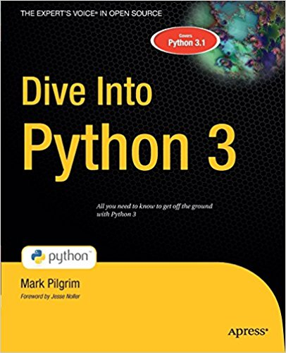

# Study-Group
## For those who CL (continuously learn)

## This is where we are starting ... http://www.diveintopython3.net/

Sept 19 we have Pycharm Community installed and started with [lesson1](http://www.diveintopython3.net/your-first-python-program.html) 

### Here's study option 1:

#### Coding challenge - https://github.com/freeCodeCamp/python-coding-challenges
 

## Who we are:
 https://github.com/faafeefoo  
 https://github.com/mjoyce6500  
 https://github.com/maarmar
 
